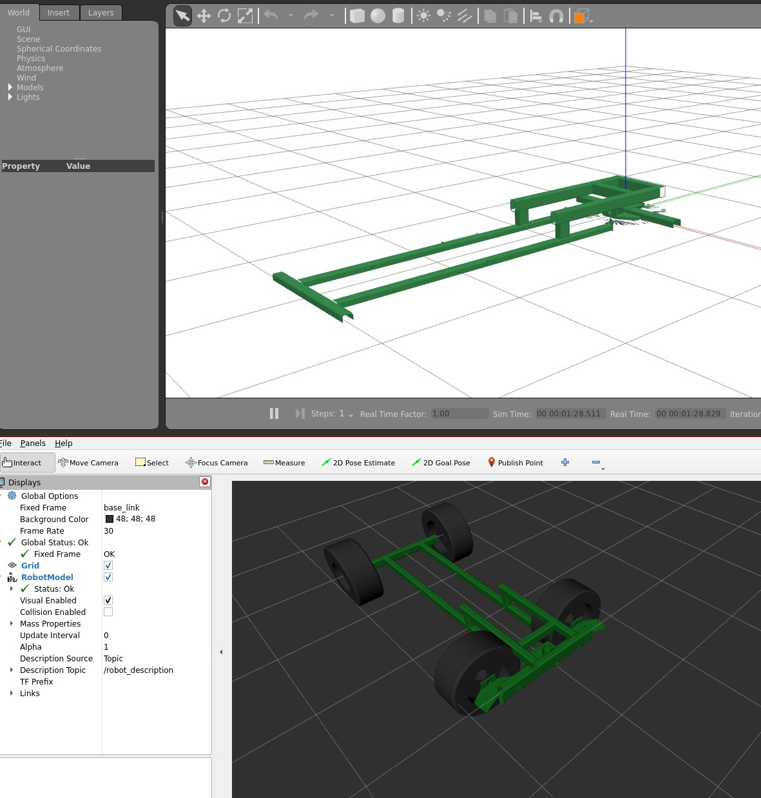
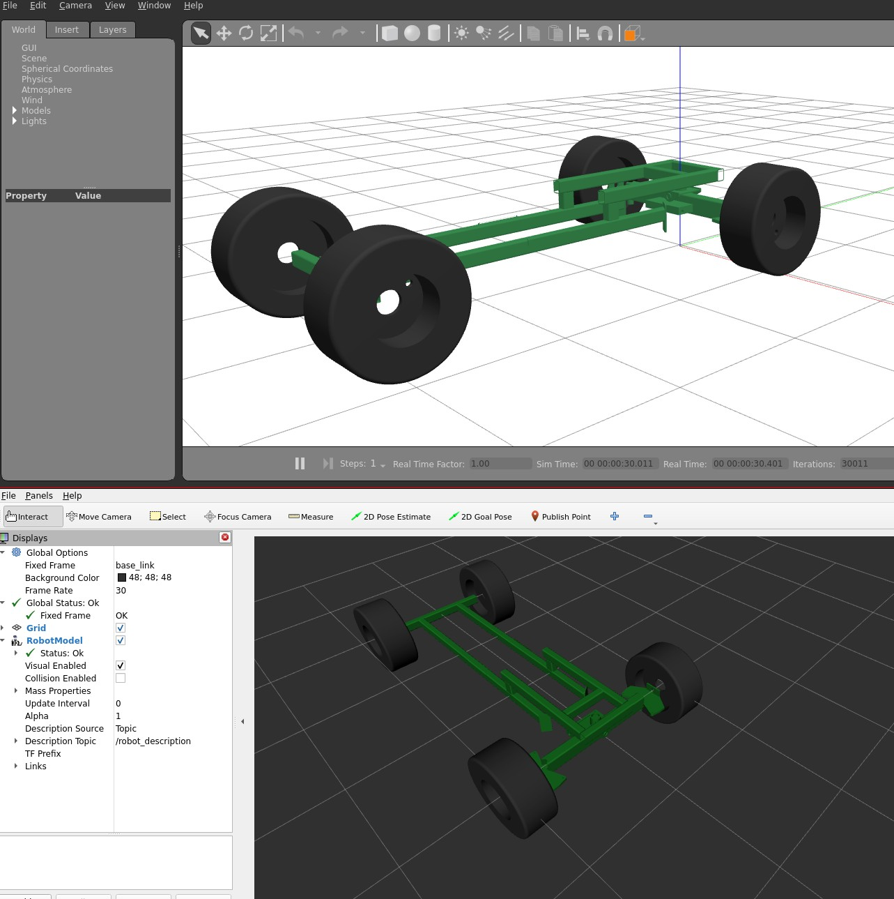

# Control MRE

This is a test repo to verify the gazebo ros control package for ROS2 Humble. This was built for GH Issue https://github.com/ros-controls/gazebo_ros2_control/issues/242

## Setup
After downloading the repo, pull in the `gazebo_ros2_control` package to the ws.
```
$ cd src
$ git clone https://github.com/ros-controls/gazebo_ros2_control.git 
```

Source the ROS2 humble as needed and the local ws
```
$ source /opt/ros/humble/setup.zsh ; source install/setup.zsh
```

## Testing

### Verify broken
Pull the latest of the gabzebo ros control package for Humble.
```
$ cd control_mre/src/gazebo_ros2_control
$ git checkout humble       
$ colcon build ; ros2 launch control_mre launch.py
```




### Verify working

Pull the latest of the gabzebo ros control package for Humble.
```
$ cd control_mre/src/gazebo_ros2_control
$ git checkout 0.4.4~12
$ colcon build ; ros2 launch control_mre launch.py
```
